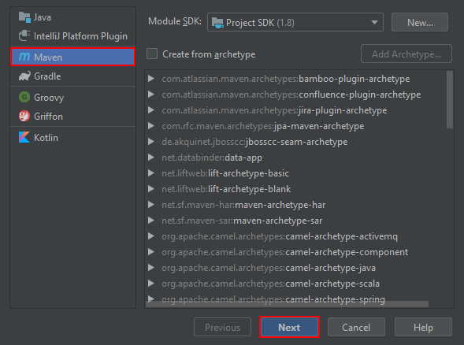
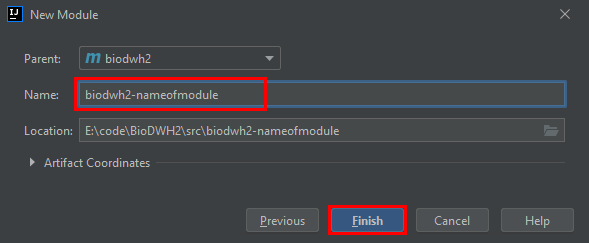

# Setup

For developing BioDWH2 in a consistent way, certain mechanisms are in place to guarantee good code quality. This includes the choice of IDE which in this case is [IntelliJ IDEA](https://www.jetbrains.com/idea/). As an open source project, BioDWH2 can be developed with the free community edition of IntelliJ.

During setup, make sure to install the following plugins:

- Maven integration
- Git integration

Alternatively, the plugins can be installed/enabled under ```Settings > Plugins```.

## Coding style setup

One of the advantages of IntelliJ IDEA is the automated code formatting. This ensures a higher code quality and less merge conflicts. Included in this repository is a coding style configuration file ([CodingStyle.xml](CodingStyle.xml)) which can be directly imported into IntelliJ IDEA. Developers and contributers of BioDWH2 need to adhere to this coding style. The import is very easy. First, go to ```Settings > Editor > Code Style > Java```. Click on the cog icon and select ```Import Scheme > Intellij IDEA code style XML```.


With the BioDWH2 scheme imported and selected, click the cog icon again, select ```Copy to Project``` and confirm the overwrite.

Now the automatic code formatting is using the BioDWH2 coding style. Formatting an open code file can be done either by the menu ```Code > Reformat Code``` or the shortcut ```Strg + Alt + L```.

## Opening the maven project in IntelliJ IDEA


## Creating a new parser module

Creating a new parser module is pretty simple, but for consistency we go through the steps in short. First, right click the project ```src``` folder and select ```New > Module```.


Second, select ```Maven``` as the module type and click ```Next```.



Now enter the artifact id for the new module, all other values are inherited. The artifact id follows the structure ```biodwh2-[a-z]+``` where the suffix is unique and identifying the data source that is processed in this module. Click ```Next```.



The module name by default removes the ```-``` character, please make sure to add it again to match the artifact id. Click ```Finish```.


Now your new module should be created and added to the module list. Open the ```pom.xml``` of your module and add the dependencies for the ```biodwh2-core``` module and the ```junit``` unit testing library as follows:


Finally, make sure to add the package structure in your modules ```src > main > java``` like ```de.unibi.agbi.biodwh2.yourmodulename``` and follow the package structure like the other parser modules.
